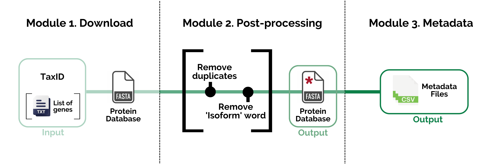

# ProteoParc: A pipeline for the creation of protein databases focused on paleoprotein mass spectrometry identification.

**Version 1.0**

## What is this?

ProteoParc is a pipeline that creates a protein multi-fasta database meant to be used in mass spectrometry software for protein identification. The software downloads the protein records from [UniParc](https://www.uniprot.org/help/uniparc), a non redundant repository that stores all the proteins found in more than 20 databases, including Ensembl, RefSeq, and UniProt among others. The search is focused on a specific taxonomic group (indicated using the NCBI/UniProt [TaxID](https://www.ncbi.nlm.nih.gov/books/NBK53758/#_taxonomyqs_Data_Model_)) and can be reduced to a certain group of genes to decrease the protein identification computational cost.

Although its use can be very diverse, this pipeline is intended to generate protein databases for palaeoprotein identification, where it is important to include protein information from a diverse number of extant and extinct species.

## How do I use it?

The pipeline is based on three modules:

1.  **Download module**. Creates a multi-fasta database file with the proteins that fulfill the search requirements.
2.  **Post processing module**. Does optional modifications to the multi-fasta database, like removing redundant records with exact or substring sequences or removing the word 'isoform' from the record headers.
3.  **Metadata module**. Generates some tables and files with metadata information about the database, like the number of species retrieved or the genes not found during the search.

*Pipeline's workflow, the elements in square brackets mean optional inputs or actions*

All these modules are merged in one [Python](https://www.python.org) script, named `proteoparc.py`. A very short usage can be seen trying `python3 proteoparc.py -h` or `python3 proteoparc.py --help` in the terminal. However, we recommend the user to read the [**Tutorial**](documentation/tutorial.md) for a more detailed -but still short- explanation, especially if bioinformatics is something new for you.

The details of the code and output files are explained in the [**Code Overview**](documentation/code.md) manual.

## License

This pipeline has been possible thanks to a lot of collective work, so its citation in any study in which it is used would be appreciated. Every user is free to change any section of the code so it can be adjusted to individual necessities, if you do so, please indicate it in your manuscripts to avoid confusion. For more information, read the [**License**](LICENSE.md)
