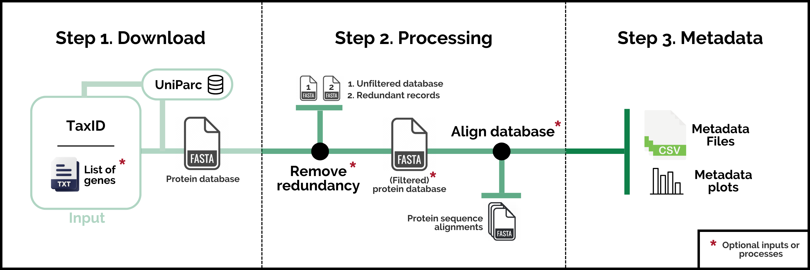

# ProteoParc: A tool to generate protein reference databases for ancient and non-model organisms

**Version 1.2**

## What is ProteoParc?
ProteoParc is a pipeline to generate reference multi-fasta protein databases with a focus on ancient and non-model organisms analyses. In short, it works as a protein downloader and processor of [UniParc](https://www.uniprot.org/help/uniparc), a non-redundant archive storing peptide sequences found in more than 20 repositories, including Ensembl, RefSeq, and UniProt. The search is focused on a specific taxonomic group (indicated using the NCBI/UniProt [TaxID](https://www.ncbi.nlm.nih.gov/books/NBK53758/#_taxonomyqs_Data_Model_)) and can be reduced to a certain group of gene names to increase database specificity. While ProteoParc can be used for various purposes, its primary aim is to generate reference databases for paleoproteomics and the analysis of non-model organisms. This is particularly important for incorporating protein information from a wide range of extant and extinct species.

## How does it work?
A concise usage can be seen by typing `python3 proteoparc.py -h` or `python3 proteoparc.py --help`. However, we recommend reading the [**Tutorial**](documentation/tutorial.md) for a more detailed -but still short- explanation of requirements, set-up, and pipeline execution. Coding and output details are explained in the [**Output & Code Overview**](documentation/code.md) manual. ProteoParc's performance is based on three different steps:

1.  **Download**. Builds a multi-fasta database with proteins that fulfil the search requirements.

2.  **Processing**. Performs some optional processes to the multi-fasta:

    -   Removing redundant records with exact or fragment (sub-string) sequences to decrease the number of comparisons in protein identification software.
    -   Generating a protein sequence alignment per each gene name to manually detect bad-quality records.

3.  **Metadata**. Generates some tables, files, and plots with metadata information about the database, like the number of species retrieved or the gene names not found during the search.

    _Disclaimer: Each record can be associated with multiple repositories and/or species. As a result, the total number of repositories or species may exceed the number of records, and should not be interpreted as a one-to-one correspondence._

## License & citation
Please cite the following paper when using ProteoParc for your studies: https://doi.org/10.1101/2025.07.31.667843. Code changes are accepted in any section of the script, if you do so, please account for it in your publications. Read the [**License**](LICENSE.md) document for more information about what can/can't be done.
