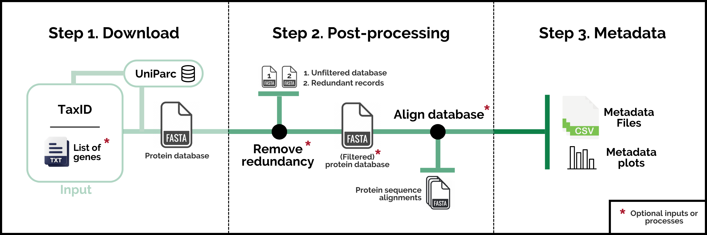

# ProteoParc: A bioinformatic tool to generate reference databases for ancient protein data analysis

**Version 1.1**

## What is ProteoParc?

ProteoParc is a pipeline to generate reference multi-fasta protein databases for MS/MS peptide identification. In short, it works as a protein downloader and processor of [UniParc](https://www.uniprot.org/help/uniparc), a non-redundant archive storing peptide sequences found in more than 20 repositories, including Ensembl, RefSeq, and UniProt. The search is focused on a specific taxonomic group (indicated using the NCBI/UniProt [TaxID](https://www.ncbi.nlm.nih.gov/books/NBK53758/#_taxonomyqs_Data_Model_)) and can be reduced to a certain group of gene names to increase database specificity. Although its use can be diverse, ProteoParc is intended to generate reference databases for paleoproteomic analysis, where it is crucial to include protein information from a diverse number of extant and extinct species.

## How does it work?

A concise usage can be seen by typing `python3 proteoparc.py -h` or `python3 proteoparc.py --help` in the terminal. However, we recommend reading the [**Tutorial**](documentation/tutorial.md) for a more detailed -but still short- explanation of requirements, set-up, and pipeline execution. Coding and output details are explained in the [**Output & Code Overview**](documentation/code.md) manual. ProteoParc's performance is based on three different steps:

1.  **Download**. Builds a multi-fasta database with proteins that fulfil the search requirements.

2.  **Post-processing**. Performs some optional processes to the multi-fasta:

    -   Removing redundant records with exact or fragment (sub-string) sequences to decrease the number of comparisons in protein identification software.
    -   Generating a protein sequence alignment per each gene name to detect bad-quality records easily.

3.  **Metadata**. Generates some tables, files, and plots with metadata information about the database, like the number of species retrieved or the gene names not found during the search.

    Disclaimer: Information in metadata files can be underestimated due to UniParc's non-redundant architecture. Evolutionarily conserved proteins will appear only once in UniParc, which biases the number of species recovered. This is also the case for two proteins present in different repositories, as the metadata information will be merged in one UniParc record. That is why we recommend the user to **take the metadata information as the minimum knowledge of the database**.

*ProteoParc's workflow; Asterisk elements are optional inputs or processes*

## License & citation

Please cite the following paper when using ProteoParc for your studies: [not published yet]. Code changes are accepted in any section of the script, if you do so, please account for it in your publications. Read the [**License**](LICENSE.md) document for more information about what can/can't be done.
