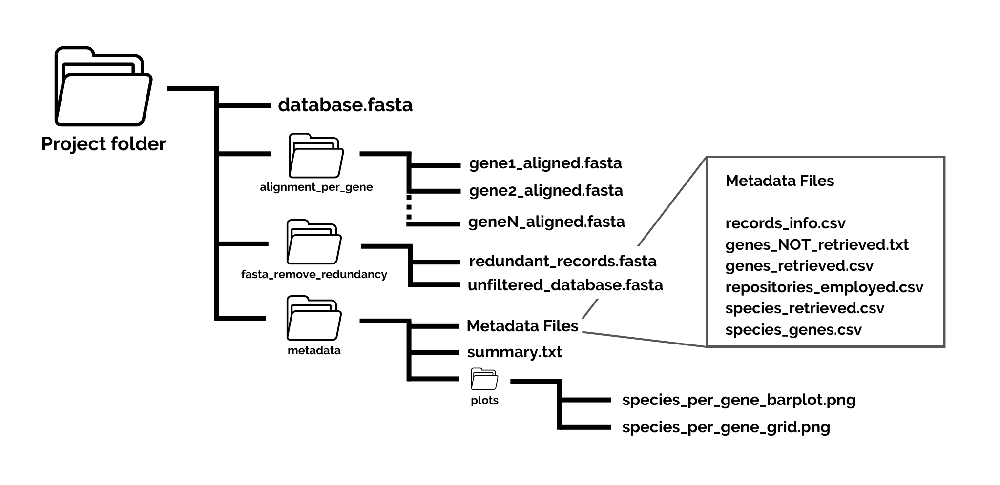

# Output & Code Overview ProteoParc 1.1

## ProteoParc output



### Protein multi-fasta database

The main output of ProteoParc is a **multi-fasta protein database**. The header of each record has no commas (,), semicolons (;) or colons (:) to avoid interferences with CSV files. The header architecture is based on the UniProt format:

``` textinfo
>Database|Unique_identifier[_Gene_name]|Last_update [Protein_name] OS=Specie OX=TaxID [GN=Gene_name] SV=Sequence_version

# Information in brackets might not be present in some records due to incomplete annotations 
```

|                       |                                                                                                                                   |
|-----------------|-------------------------------------------------------|
| **Repository**        | Source repository of the record. The list of potential repositories can be seen [here](https://www.uniprot.org/help/uniparc).     |
| **Unique Identifier** | Primary accession number corresponding to the UniParc record.                                                                     |
| **Last update**       | Date of the last time the UniParc record was modified. Changes can be due to typos correction or metadata alteration.             |
| **Protein name**      | A short name to describe the protein. This field can be omitted due to incomplete annotations.                                    |
| **Specie**            | The scientific name of the organism associated with the protein.                                                                  |
| **TaxID**             | TaxID of the species.                                                                                                             |
| **Gene name**         | Abbreviation, in capital letters, of the gene that codifies the protein. This field can be omitted due to incomplete annotations. |
| **Sequence version**  | Version number of the sequence. In contrast to the *Last update* field, this number only changes if the sequence is modified.     |

Below, some real record headers are shown as an example:

``` textinfo
# Complete annotated record:
>RefSeq|UPI002116250B_ALB|2024-03-04 albumin isoform X1 OS=Elephas maximus indicus OX=99487 GN=ALB SV=1

# Incomplete annotated record:
>UniProtKB/Swiss-Prot|UPI00005CA243|2007-06-26 OS=Mammuthus primigenius OX=37349 SV=1
```

### Protein sequence alignments

A protein sequence alignment is built per each different gene name found in the database. These alignments are outputted as multi-fasta files with hyphens ("-") representing unaligned positions:

``` textinfo
>UniProtKB/TrEMBL|UPI0001C5D781_AMELX|2024-05-29 Amelogenin X-linked OS=Loxodonta africana OX=9785 GN=AMELX SV=1
MGTWILFACLLGAAFAMPLPPHPGHPGYINFSYEVIF--LFSILMSPSLKVLTPLKWYQN
MIRQPYPSYGYEPMGGWLHHQIIPVLSQQHPQSHTLQPHHHFPMVAAQQPVVPQQPMMPL
PGQHSMTPTQHHQPNLPPPIQQPYQPQPVQPQPQQPMQPQPPVHPIQPLPPQPPLPPMFP
MQPLPPMLHDLPLEAWPATDKTKREEV------------------------
>RefSeq|UPI000C812773_AMELX|2024-03-04 amelogenin X isoform isoform X2 OS=Loxodonta africana OX=9785 GN=AMELX SV=1
MGTWILFACLLGAAFAMPLPPHPGHPGYINFSYEA---------TSIDRTVLTPLKWYQN
MIRQPYPSYGYEPMGGWLHHQIIPVLSQQHPQSHTLQPHHHFPMVAAQQPVVPQQPMMPL
PGQHSMTPTQHHQPNLPPPIQQPYQPQPVQPQPQQPMQPQPPVHPIQPLPPQPPLPPMFP
MQPLPPMLHDLPLEAWPATDKTKREEVVSAPRSRHSTSPGGMGEQNGPPEF
```

### Redundancy files

1.  redundant_records.fasta; Records removed through the "remove redundancy" step.
2.  unfiltered_database.fasta; Prime protein database version, with redundant records still present.

The number of exact and fragment records removed can be seen in the printed output after this step's execution.

### Metadata files

Disclaimer: Information in metadata files can be underestimated due to UniParc's non-redundant architecture. Evolutionarily conserved proteins will appear only once in UniParc, which biases the number of species recovered. This is also the case for two proteins present in different repositories, as the metadata information will be merged in one UniParc record. That is why we recommend the user to **take the metadata information as the minimum knowledge of the database**.

Six metadata files are generated. Additionally, an extra file is generated if a gene list is imputed to build the database:

1.  summary.txt; A text file with a summary of all the metadata information retrieved from the multi-fasta database. It also shows the paths to all the other files.

2.  records_info.csv; A CSV file that contains all the information present in each record header. Records without a gene name are indicated in the "Gene" column as "no gene". If any cell is found empty, please report the case.

3.  genes_retrieved.csv; A CSV file that contains the number of genes retrieved.

4.  species_retrieved.csv; A CSV file that contains the number of species retrieved, indicating the scientific name and the TaxID.

5.  repositories_employed.csv; A CSV file that contains the number of the different sources (repositories) used to build the multi-fasta.

6.  species_genes.csv; A CSV file that shows the number of genes retrieved for each species.

7.  genes_NOT_retrieved.txt; A text file that contains the genes not retrieved. This file is only generated if a list of genes used to build the multi-fasta is specified.

Two plots are also generated to visually see the content in the multi-fasta. Databases containing more than 15 species and/or 35 genes can lead to messy plots, so a warning message is printed even if the plots look great in the end:

1.  plot/species_per_gene_barplot.jpg; A barplot representing the number of different protein records per each species and gene name.
2.  plot/species_per_gene_grid.jpg; A grid representing the presence or absence of each gene name per species.

------------------------------------------------------------------------

## ProteoParc code

ProteoParc code is based on five Python and two R scripts. proteoparc.py is the main script, merging and concatenating the pipeline steps to execute the software. Each script can be executed separately to run a process again after modifying an output. For instance, re-running `python3 metadata_proteoparc.py` after manually removing some records from the reference database.

### 1. proteoparc.py

This software concatenates some scripts to create a reference protein multi-fasta database for LC-MS/MS protein identification. The performance of this pipeline can be split into **three different steps**:

1.  **Download**. Creates a multi-fasta database file with the proteins that fulfil the search requirements.
2.  **Post-processing**. Does optional modifications to the multi-fasta database:
    -   Remove redundant records with exact or substring sequences.
    -   Align each protein record by the gene name
3.  **Metadata**. Generates some CSV tables and files with metadata information about the database, like the number of species retrieved or the genes not found during the search.

### 2. uniparc_download.py

This script creates a multi-fasta protein database using the UniParc archive, a non-redundant archive containing all the proteins sequenced or predicted in UniProt, NCBI, and other repositories. The search is focused on a specific taxonomic group by a TaxID and can be restricted to a certain group of genes, indicated by a text file. Proteins from the *FusionGDB* repository are not being downloaded, as those peptides have a synthetic origin.

The download process through the UniParc API is done by pagination. This is a special type of download that retrieves records in batches of 500, allowing for faster and more efficient performance.

### 3. remove_redundant_records.py

This script searches for duplicate and fragmentary sequences between records in a multi-fasta and removes that redundancy. It writes two outputs, one with the filtered multi-fasta (without redundancy) and another multi-fasta with the records removed. The way it detects redundancy is based on the sequence (DNA or protein), and it can occur in two different situations:

I.  Both records have the same sequence. In this case, the removed record is the first to be found in the multi-fasta. For example, among the following records, 'A' will be removed from the multi-fasta:

``` texinfo
A. MPIVCLGLLVFGLT
B. MPIVCLGLLVFGLT
```

II. One record has a sequence that is a substring from another. In this case, the removed record is the one containing the substring, in other words, the one with the shortest sequence length. For example, among the following records, 'B' will be removed from the multi-fasta:

``` texinfo
A. MPIVCLGLLVFGLT
B.   IVCLGL
```

### 4. align_database_per_gene.py

This script generates an aligned multi-fasta file per each different gene name present in a multi-fasta. To do so, the header format should indicate the gene name before the string "GN=". mafft v7.525 has been chosen to build each different alignment.

### 5. metadata_proteoparc.py

This script generates metadata files with information about a multi-fasta protein database, outputted from the uniparc_download.py script. Six metadata files are generated. Additionally, an extra file is generated if a gene list is imputed to build the database.

### 6. proteoparc_barplot.R

This script takes the species_genes.csv file (ouputed from metadata_proteoparc.py) and generates a regular barplot representing the number of different protein variants per gene name and species.

### 7. proteoparc_grid.R

This script takes the species_genes.csv file (ouputed from metadata_proteoparc.py) and generates a grid representing the presence or absence of a protein per each species in the database.
